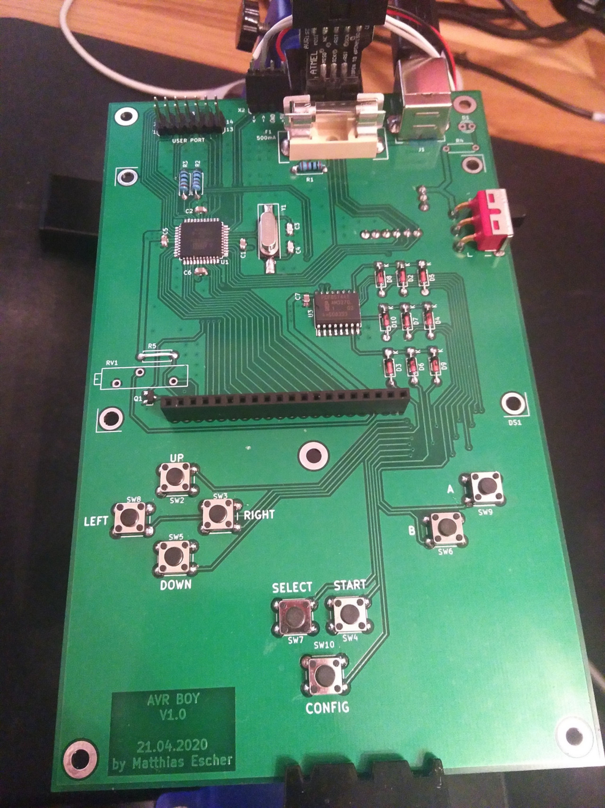

[](https://travis-ci.org/Dante999/avr-boy)

# AVR BOY
This project is something I would like to do since my childhood: Creating my own
handheld game console. Of course not as much powerful as the 'Game Boy' or even
newer stuff, but something I have created from scratch. This includes the
designing the schematic, layouting the pcb and writing the firmware. 

In this first try of building such a device, the main goal is to gather
as much knowledge as possible and learn why some of my concepts worked well and
why others not.

Here is a picture of the hardware version 1.0 without attached display and
missing potentiometer RV1




## Architecture
```
                      +-----------+
                      |  Buttons  |
                      +-----+-----+
                            |
                            |
                            v
                      +-----+-----+               +----------------+
+-----------+         |           |      SPI      |                |
| User Port +<------->+  AVR Boy  +<------------->+ Game Cartridge |
+-----------+         |           |               |                |
                      +-----+-----+               +----------------+
                            |
                            |
                            v
                      +-----+-----+
                      |    LCD    |
                      +-----------+
```


## Hardware Details

Category        | Description
----------------|-------------------------------------------------------------
Main Controller | Atmega32A
Graphical LCD   | TG12864B-13B (128x64 pixel, 8bit bus, KS0108 compatible)
Power Supply    | 5V (USB-B connector)
User Input      | 9 Buttons (Up,Down,Left,Right,A,B,Start,Select,Config)
Game Cartridge  | Communication over SPI
